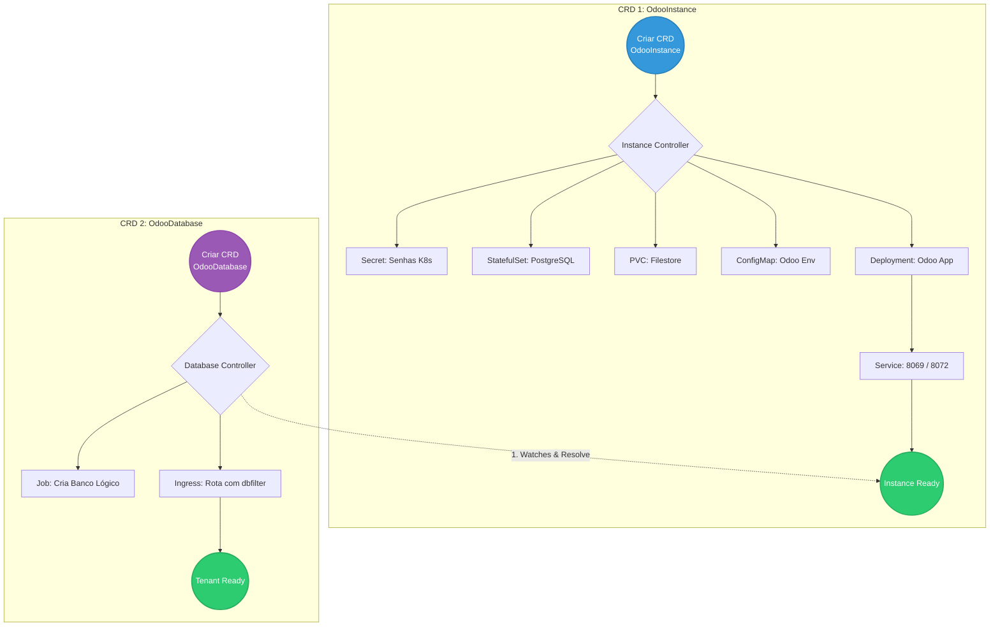

# 🐘 Odoo Operator for Kubernetes

Este repositório contém a implementação de um **Kubernetes Operator** multi-tenant desenvolvido para gerenciar o ERP open-source Odoo. O projeto utiliza o padrão **Chain of Responsibility** para orquestrar a infraestrutura compartilhada (PostgreSQL, Filestore, App) e o provisionamento isolado de bancos de dados lógicos para múltiplos clientes.

---

## 🏗️ Arquitetura e Fluxo de Reconciliação (Multi-Tenant)

O ecossistema é dividido em dois Custom Resources (CRDs) independentes, mas correlacionados:



📋 Pré-requisitos
Go (v1.24+)

Docker

kubectl

Kind (para criação do cluster local)

kubebuilder v4

Tilt

## 🚀 Como Executar e Simular (Desenvolvimento Local)

Para garantir um fluxo de desenvolvimento rápido e contínuo (Live Reload), este projeto faz uso do **Tilt**.

**1. Suba o cluster local:**
```bash
kind create cluster
```

⚠️ Problemas Conhecidos e Soluções (Troubleshooting)\

<details open>
<summary>📖 <strong>Diário de Desenvolvimento (Clique para expandir)</strong></summary>

* **[05/06/2026] - Setup Inicial e Planejamento:**
  * Leitura e assimilação do escopo (Odoo multi-tenant).
  * Criação do repositório `odoo-operator` e entendimento da necessidade de dois CRDs (`OdooInstance` e `OdooDatabase`).
* **[05/06/2026] - O Contrato (CRDs) e Factory Pattern:**
  * Modelagem das APIs e geração automática de manifestos (`make manifests`).
  * Implementação do **Factory Pattern** (`internal/factory`), resolvendo elegantemente a injeção tripla de configuração do Odoo.
* **[05/06/2026] - Chain of Responsibility e Multi-Tenancy:**
  * Implementação dos Ensurers para Instância e Tenant.
  * Resolução de Condições de Corrida via `ResolveInstanceEnsurer` (O Guardião).
  * Uso avançado de `Watches()` Cross-Kind para reatividade entre os controladores.
* **[05/06/2026] - Troubleshooting SRE e Entrega Final:**
  * Correção de permissões de RBAC para permitir a gestão de `Jobs` e `Ingress` pelo Operator.
  * Resolução de conflito de entrypoint nativo do Docker (`/entrypoint.sh`) alterando a injeção de parâmetros de `Command` para `Args`.
  * Sincronismo de estado e persistência: Identificação e resolução do "disco fantasma" (PVC), garantindo a integridade de senhas entre K8s Secrets e o PostgreSQL.
  * **Status Final:** Servidor (OdooInstance) e Tenant (OdooDatabase) provisionados de forma autônoma, atingindo a fase `Ready` com sucesso.
* **[09/06/2026] - Roteamento Profissional e Homologação do ERP:**
  * Implementei o NGINX Ingress Controller no cluster local Kind para centralizar as regras de entrada de tráfego.
  * Configurei o manifesto de `Ingress` mapeando o host corporativo virtualizado para o serviço ativo do Odoo.
  * Validei com sucesso o ciclo completo de requisições eliminando resoluções genéricas (wildcards de internet), estabelecendo um padrão de resolução estática para homologação.
* **[10/06/2026] - Homologação Corporativa e Práticas de SRE**
  * **Roteamento Seguro com Ingress e Cert-Manager:** Implementação de regras de Ingress apontando para o domínio corporativo (`*.francis.tcloud-devops.cloudtotvs.com.br`). Integração nativa com o `cert-manager` para provisionamento dinâmico de certificados SSL/TLS, garantindo tráfego 100% HTTPS (Let's Encrypt).
  * **Gestão de Permissões de Volume (FSGroup):** Diagnóstico e resolução do clássico erro de permissão em Persistent Volumes em nuvem (`PermissionError [Errno 13]`). O volume montado como `root` impedia a gravação da sessão pelo usuário restrito da aplicação.
  * **Evolução do Operador (Release v1.0.4):** Atualização do orquestrador `OdooDeploymentEnsurer`. Injeção nativa do `SecurityContext` (`FSGroup: 101`) no manifesto de Deployment. Toda nova instância provisionada pelo Operator agora nasce inerentemente segura e com as permissões de acesso a disco já resolvidas.
  * **Validação Multi-tenant:** Comprovação da resiliência do Operator no gerenciamento dinâmico de múltiplos bancos de dados PostgreSQL para instâncias isoladas (Tenants) através da leitura de Custom Resources.

</details>

## 🚀 Guia de Acesso Local e Debug

Nosso operador gerencia o roteamento e a segurança de forma dinâmica. Abaixo estão os manuais para interagir com a aplicação Odoo e inspecionar o Banco de Dados diretamente do seu ambiente local.

### 🌐 1. Acesso à Aplicação Web (Odoo)

Para validar e interagir com o ERP Odoo rodando no cluster local, você pode utilizar uma das três abordagens abaixo, dependendo da necessidade de exposição:

* **Método A (Acesso Direto via Port-Forward):** Ideal para desenvolvimento isolado. Cria uma ponte direta entre o pod e a sua máquina.
  * **Comando:** `kubectl port-forward svc/meu-erp 8069:8069`
  * **Acesso:** `http://localhost:8069`

* **Método B (Roteamento via Ingress + Hosts):** Ideal para simular um ambiente corporativo. Este método simula o acesso real, passando pelo Ingress (Nginx) que lê a URL e injeta automaticamente o filtro de isolamento do banco de dados (`X-Odoo-dbfilter`). Requer a configuração do Ingress Controller e a edição do arquivo `/etc/hosts` (ou `C:\Windows\System32\drivers\etc\hosts`) apontando `127.0.0.1 odoo.totvs.local`.
  * **Acesso:** `http://odoo.totvs.local`

* **Método C (Túnel Seguro via Ngrok):** Ideal para homologação externa e validação com especialistas. Expõe o serviço local para a internet com um certificado SSL/TLS válido, sem necessidade de configuração de VPN ou edição de arquivos locais por parte do cliente.
  * **Como usar:** Com a porta 8069 exposta localmente (via Método A), execute no terminal:
    ```bash
    ngrok http 8069
    ```
  * **Acesso:** Copie a URL pública gerada no terminal (ex: `https://<hash>.ngrok-free.app`)

### 🗄️ 2. Acesso Direto ao Banco de Dados (DBeaver / DataGrip)

Os bancos de dados ficam isolados no cluster por segurança. Para rodar consultas SQL nativas no tenant gerado, utilize a técnica de `port-forwarding`.

**Passo 1: Listar as Secrets**

```bash
kubectl get secrets
```

Provavelmente será algo como `meu-erp-db-secret` ou similar, dependendo de como você nomeou na `Factory`.

**Passo 1: Extrair a Senha do K8s Secret**\
O Operator gera senhas aleatórias na criação da Instância. Descriptografe a senha com o comando:

- **Linux/Mac/WSL**

```bash
kubectl get secret meu-erp-secret -o jsonpath="{.data.postgres-password}" | base64 --decode
```

- **Windows (PowerShell)**

```powershell
[System.Text.Encoding]::UTF8.GetString([System.Convert]::FromBase64String((kubectl get secret meu-erp-secret -o jsonpath='{.data.postgres-password}')))
```

**Passo 2: Abrir o Túnel de Rede**

```bash
kubectl port-forward svc/meu-erp-pg 5432:5432
```

**Passo 3: Conectar na Ferramenta SQL**

Crie uma conexão do tipo `PostgreSQL` na sua ferramenta favorita:

- **Host:** `localhost`
- **Porta:** `5432`
- **Database:** `acme` (para o tenant) ou `postgres` (master)
- **Username:** `odoo`
- **Password:** (A senha descriptografa no Passo 1)

### 🌐 3. Credenciais de Acesso ao Sistema (Tenant ACME)

- **E-mail (Usuário):** `admin`
- **Senha:** `admin`

### 🗄️ 4. Bônus: A Senha Master (Gerenciados de Banco de Dados)

Vale lembrar de um detalhe estrutural importante que vimos quando foi inspecionado o `Secret` do Kubernetes.\
Lá dentro, além da senha do PostgreSQL (`postgres-password`), o `Operator` gerou o arquivo `odoo.conf` com um parâmetro chamado `admin_passwd`. Ao decodificar essa linha é possível obter a `Senha Master` da instância.

**A Diferença entre elas:**

- `admin` / `admin`: Acesso à interface do ERP para emitit notas, cadastrar clientes, instalar módulos, etc (Específico do banco `acme`).

- **Senha Master:** Acesso a tela de `bypass`\
(`http://localhost:8069/web/database/manager`) para criar, deletar, fazer backup ou restaurar bancos de dados interios por fora do `Operator` (Específico do servidor `meu-erp`).

## 📦 Instalação via Helm Chart (Recomendado para Produção)

O `odoo-operator` foi empacotado utilizando o Helm, garantindo uma implantação parametrizável, segura e rastreável em ambientes Cloud Native. O Chart gerencia nativamente a criação da ServiceAccount, RBAC (ClusterRoles e Bindings) e o Deployment do controlador.

### Estrutura do Pacote
Os manifestos do Helm estão localizados na pasta `charts/odoo-operator/`:
- `values.yaml`: Centraliza todas as variáveis (imagem, tag, resources, securityContext).
- `crds/`: Contém as definições do Custom Resource (`OdooInstance`). Ficam isoladas para garantir segurança em upgrades (evitando deleções acidentais de tenants).
- `templates/`: Manifestos parametrizados do controlador e permissões.

### Como Instalar

**1. Validação do Chart (Lint & Dry-run)**
Antes de aplicar no cluster, você pode validar a sintaxe e visualizar a renderização final dos manifestos:
```bash
helm lint charts/odoo-operator
helm template odoo-operator charts/odoo-operator
```

## 🌟 Arquitetura e Roteamento (Padrão Enterprise)

Este operador adota padrões avançados de roteamento em nuvem, descartando Ingresses tradicionais em favor de uma integração fluida com malhas de rede externas:

* **Integração com ExternalDNS:** O operador cria dinamicamente serviços do tipo `ExternalName` anotados para propagação automática em zonas de DNS na nuvem.
* **TLS Nativo via Cert-Manager:** Geração automática de requisições ACME (`Certificates`) vinculadas ao `ClusterIssuer`, garantindo criptografia Let's Encrypt/CA Interna com zero intervenção manual.
* **K9s UX Ready:** Custom Columns configuradas nativamente nos CRDs (`+kubebuilder:printcolumn`). Visualize as URLs de acesso e a saúde das instâncias (`Phase`) diretamente nas listagens do Kubernetes.

## 🚀 Como usar

A definição do `OdooInstance` foi projetada para ser declarativa e enxuta. O campo `domain` é obrigatório e atua como o gatilho para a geração de toda a infraestrutura de rede e criptografia.

```yaml
apiVersion: odoo.cloud104.io/v1alpha1
kind: OdooInstance
metadata:
  name: meu-erp
  namespace: default
spec:
  domain: meu-erp.empresa.com.br
  odoo:
    image: odoo:17.0
    replicas: 1
    storageSize: 5Gi
  database:
    image: postgres:16
    user: odoo
    storageSize: 10Gi
```
## 🛠️ Instalação via Helm

O deployment do operador é gerenciado via Helm Chart, garantindo a configuração correta do RBAC (incluindo permissões de cert-manager e Leader Election).

```bash
helm upgrade --install odoo-operator ./charts/odoo-operator -n odoo-operator-system --create-namespace
```