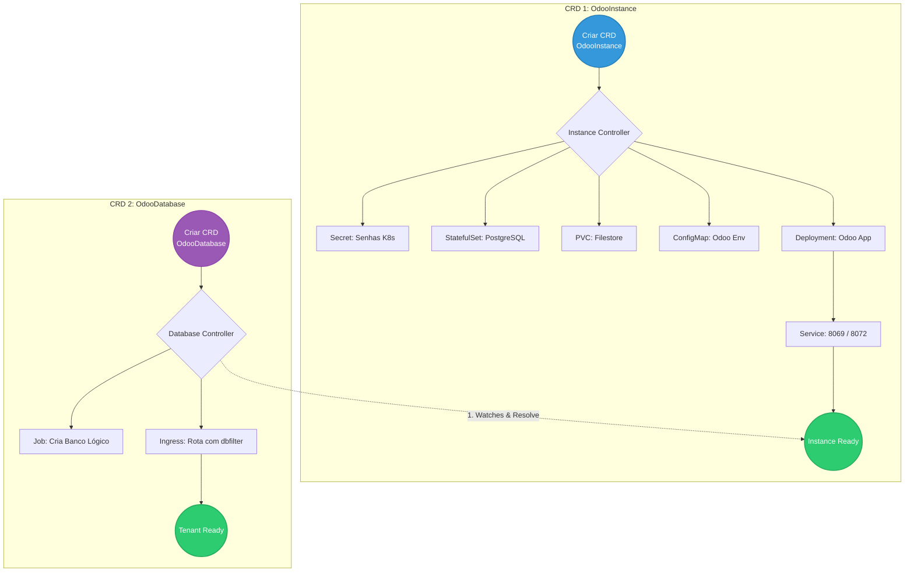

# 🐘 Odoo Operator for Kubernetes

Este repositório contém a implementação de um **Kubernetes Operator** multi-tenant desenvolvido para gerenciar o ERP open-source Odoo. O projeto utiliza o padrão **Chain of Responsibility** para orquestrar a infraestrutura compartilhada (PostgreSQL, Filestore, App) e o provisionamento isolado de bancos de dados lógicos para múltiplos clientes.

---

## 🏗️ Arquitetura e Fluxo de Reconciliação (Multi-Tenant)

O ecossistema é dividido em dois Custom Resources (CRDs) independentes, mas correlacionados:

📋 Pré-requisitos
Go (v1.24+)

Docker

kubectl

Kind (para criação do cluster local)

kubebuilder v4

🚀 Como Executar e Simular (Em Breve)\

(Os comandos de implantação, port-forward e simulação de criação/destruição serão documentados aqui conforme o avanço do projeto).

⚠️ Problemas Conhecidos e Soluções (Troubleshooting)\

(Espaço reservado para documentar os desafios de infraestrutura e código encontrados durante a jornada).

* [05/06/2026] - Setup Inicial e Planejamento:
  * Leitura e assimilação do escopo (`Odoo multi-tenant`).
  * Criação do repositório `odoo-operator` e definição do padrão arquitetural da documentação.
  * Entendimento da necessidade de dois CRDs (`OdooInstance` e `OdooDatabase`) e dos conceitos de `Referência Cruzada`, `Watches()` e `Idempotência via Kubernetes Jobs`.