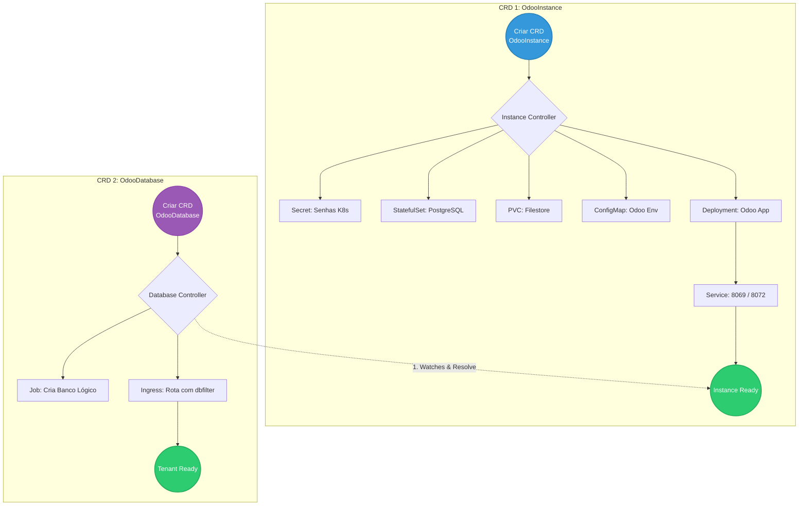

# 🐘 Odoo Operator for Kubernetes

Este repositório contém a implementação de um **Kubernetes Operator** multi-tenant desenvolvido para gerenciar o ERP open-source Odoo. O projeto utiliza o padrão **Chain of Responsibility** para orquestrar a infraestrutura compartilhada (PostgreSQL, Filestore, App) e o provisionamento isolado de bancos de dados lógicos para múltiplos clientes.

---

## 🏗️ Arquitetura e Fluxo de Reconciliação (Multi-Tenant)

O ecossistema é dividido em dois Custom Resources (CRDs) independentes, mas correlacionados:



📋 Pré-requisitos
Go (v1.24+)

Docker

kubectl

Kind (para criação do cluster local)

kubebuilder v4

Tilt

## 🚀 Como Executar e Simular (Desenvolvimento Local)

Para garantir um fluxo de desenvolvimento rápido e contínuo (Live Reload), este projeto faz uso do **Tilt**.

**1. Suba o cluster local:**
```bash
kind create cluster
```

⚠️ Problemas Conhecidos e Soluções (Troubleshooting)\

<details open>
<summary>📖 <strong>Diário de Desenvolvimento (Clique para expandir)</strong></summary>

* **[05/06/2026] - Setup Inicial e Planejamento:**
  * Leitura e assimilação do escopo (Odoo multi-tenant).
  * Criação do repositório `odoo-operator` e entendimento da necessidade de dois CRDs (`OdooInstance` e `OdooDatabase`).
* **[05/06/2026] - O Contrato (CRDs) e Factory Pattern:**
  * Modelagem das APIs e geração automática de manifestos (`make manifests`).
  * Implementação do **Factory Pattern** (`internal/factory`), resolvendo elegantemente a injeção tripla de configuração do Odoo.
* **[05/06/2026] - Chain of Responsibility e Multi-Tenancy:**
  * Implementação dos Ensurers para Instância e Tenant.
  * Resolução de Condições de Corrida via `ResolveInstanceEnsurer` (O Guardião).
  * Uso avançado de `Watches()` Cross-Kind para reatividade entre os controladores.
* **[05/06/2026] - Troubleshooting SRE e Entrega Final:**
  * Correção de permissões de RBAC para permitir a gestão de `Jobs` e `Ingress` pelo Operator.
  * Resolução de conflito de entrypoint nativo do Docker (`/entrypoint.sh`) alterando a injeção de parâmetros de `Command` para `Args`.
  * Sincronismo de estado e persistência: Identificação e resolução do "disco fantasma" (PVC), garantindo a integridade de senhas entre K8s Secrets e o PostgreSQL.
  * **Status Final:** Servidor (OdooInstance) e Tenant (OdooDatabase) provisionados de forma autônoma, atingindo a fase `Ready` com sucesso.

</details>

## 🚀 Guia de Acesso Local e Debug

Nosso operador gerencia o roteamento e a segurança de forma dinâmica. Abaixo estão os manuais para interagir com a aplicação Odoo e inspecionar o Banco de Dados diretamente do seu ambiente local.

### 🌐 1. Acesso à Aplicação Web (Odoo)

**Método A: Acesso de Cliente / Tenant (Via Ingress)**
Este método simula o acesso real, passando pelo Ingress (Nginx) que lê a URL e injeta automaticamente o filtro de isolamento do banco de dados (`X-Odoo-dbfilter`).
* **Opção Dinâmica (nip.io):** Configure o `domain` no manifesto como `acme.127.0.0.1.nip.io` e acesse no navegador: 👉 **http://acme.127.0.0.1.nip.io**
* **Opção Estática (Hosts):** Mapeie `127.0.0.1 acme.erp.local` no arquivo `/etc/hosts` (ou `C:\Windows\System32\drivers\etc\hosts`) e acesse: 👉 **http://acme.erp.local**

**Método B: Acesso Administrativo Direto (Bypass)**
Cria um túnel direto para o pod da aplicação, ignorando as regras de Ingress. Ideal para acessar o "Database Manager" raiz do Odoo.
```bash
kubectl port-forward svc/meu-erp-app 8069:8069
```

### 🗄️ 2. Acesso Direto ao Banco de Dados (DBeaver / DataGrip)

Os bancos de dados ficam isolados no cluster por segurança. Para rodar consultas SQL nativas no tenant gerado, utilize a técnica de `port-forwarding`.

**Passo 1: Listar as Secrets**

```bash
kubectl get secrets
```

Provavelmente será algo como `meu-erp-db-secret` ou similar, dependendo de como você nomeou na `Factory`.

**Passo 1: Extrair a Senha do K8s Secret**\
O Operator gera senhas aleatórias na criação da Instância. Descriptografe a senha com o comando:

- **Linux/Mac/WSL**

```bash
kubectl get secret meu-erp-secret -o jsonpath="{.data.postgres-password}" | base64 --decode
```

- **Windows (PowerShell)**

```powershell
[System.Text.Encoding]::UTF8.GetString([System.Convert]::FromBase64String((kubectl get secret meu-erp-secret -o jsonpath='{.data.postgres-password}')))
```

**Passo 2: Abrir o Túnel de Rede**

```bash
kubectl port-forward svc/meu-erp-pg 5432:5432
```

**Passo 3: Conectar na Ferramenta SQL**

Crie uma conexão do tipo `PostgreSQL` na sua ferramenta favorita:

- **Host:** `localhost`
- **Porta:** `5432`
- **Database:** `acme` (para o tenant) ou `postgres` (master)
- **Username:** `odoo`
- **Password:** (A senha descriptografa no Passo 1)


