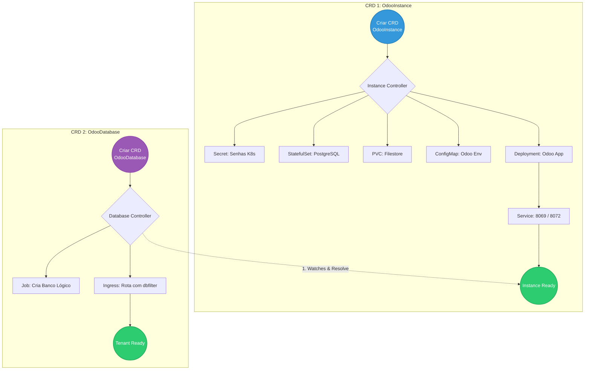

# 🐘 Odoo Operator for Kubernetes

Este repositório contém a implementação de um **Kubernetes Operator** multi-tenant desenvolvido para gerenciar o ERP open-source Odoo. O projeto utiliza o padrão **Chain of Responsibility** para orquestrar a infraestrutura compartilhada (PostgreSQL, Filestore, App) e o provisionamento isolado de bancos de dados lógicos para múltiplos clientes.

---

## 🏗️ Arquitetura e Fluxo de Reconciliação (Multi-Tenant)

O ecossistema é dividido em dois Custom Resources (CRDs) independentes, mas correlacionados:



📋 Pré-requisitos
Go (v1.24+)

Docker

kubectl

Kind (para criação do cluster local)

kubebuilder v4

Tilt

## 🚀 Como Executar e Simular (Desenvolvimento Local)

Para garantir um fluxo de desenvolvimento rápido e contínuo (Live Reload), este projeto faz uso do **Tilt**.

**1. Suba o cluster local:**
```bash
kind create cluster
```

⚠️ Problemas Conhecidos e Soluções (Troubleshooting)\

(Espaço reservado para documentar os desafios de infraestrutura e código encontrados durante a jornada).

<details open>
<summary>📖 <strong>Diário de Desenvolvimento (Clique para expandir)</strong></summary>

* **[05/06/2026] - Setup Inicial e Planejamento:**
  * Leitura e assimilação do escopo (Odoo multi-tenant).
  * Criação do repositório `odoo-operator` e entendimento da necessidade de dois CRDs (`OdooInstance` e `OdooDatabase`).
* **[05/06/2026] - O Contrato (CRDs) e Factory Pattern:**
  * Modelagem das APIs e geração automática de manifestos (`make manifests`).
  * Implementação do **Factory Pattern** (`internal/factory`), resolvendo elegantemente a injeção tripla de configuração do Odoo.
* **[05/06/2026] - Chain of Responsibility e Multi-Tenancy:**
  * Implementação dos Ensurers para Instância e Tenant.
  * Resolução de Condições de Corrida via `ResolveInstanceEnsurer` (O Guardião).
  * Uso avançado de `Watches()` Cross-Kind para reatividade entre os controladores.
* **[05/06/2026] - Troubleshooting SRE e Entrega Final:**
  * Correção de permissões de RBAC para permitir a gestão de `Jobs` e `Ingress` pelo Operator.
  * Resolução de conflito de entrypoint nativo do Docker (`/entrypoint.sh`) alterando a injeção de parâmetros de `Command` para `Args`.
  * Sincronismo de estado e persistência: Identificação e resolução do "disco fantasma" (PVC), garantindo a integridade de senhas entre K8s Secrets e o PostgreSQL.
  * **Status Final:** Servidor (OdooInstance) e Tenant (OdooDatabase) provisionados de forma autônoma, atingindo a fase `Ready` com sucesso.

</details>